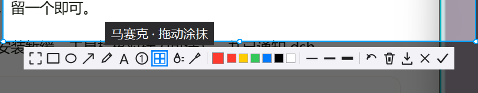

# SnapCtrlAlt

Windows 截图小工具：按 `Ctrl+Alt+D` 全局唤起，框选标注后进剪贴板。交互对标 QQ 截图，体积轻，除 [Pillow](https://python-pillow.org/) 外只用标准库。

QQ / TIM 开着的时候，优先把截图交给 QQ；QQ 不在，就用本地覆盖层。热键被占、按键注入失败，或 QQ 没真正接管时，每一层都会回落到本地截图，不会静默失败。



*框选后弹出的标注工具栏（自绘线性图标，鼠标悬停出中文提示）。*

## 功能

**框选与选区**

- 拖动框选；拖手柄改大小；在框内拖动可整体平移
- 双击选整屏；框选时带 8× 放大镜、十字准星与 `#RRGGBB` 色值
- 标注过程中在选区外按下，可直接重新框选（不必 Esc 全退）

**标注工具栏**（自绘线性图标，悬停出中文提示）

| 工具 | 说明 |
|------|------|
| 矩形 / 椭圆 / 箭头 | 常用圈注 |
| 画笔 | 自由涂画，滚轮调线宽 |
| 文字 | 点击落字 |
| 马赛克 / 高斯模糊 | 遮挡敏感信息 |
| 取色 | 读出画面颜色，可自定义描边色 |
| 撤销 / 清空 / 复制 / 另存为 | 收尾操作 |

**常驻与分流**

- 系统托盘常驻：立即截图、开机自启、优先 QQ 截图、设置、退出
- 开机自启写入 `HKCU\...\Run\SnapCtrlAlt`，与安装器同一键，不会互相覆盖
- QQ / TIM 运行时可转发其截图（默认热键 `Ctrl+Alt+A`，可在设置里改）

## 安装与运行

**免安装（推荐先试这个）**

从 [Releases](https://github.com/DannyParticle/SnapCtrlAlt/releases/latest) 下载 `SnapCtrlAlt-portable.exe`，双击即用。托盘图标出现后按 `Ctrl+Alt+D`。

**安装版**

从 [Releases](https://github.com/DannyParticle/SnapCtrlAlt/releases/latest) 下载 `SnapCtrlAlt-Setup-*.exe`。不需要管理员权限；可选开机自启。

**诊断版**

`SnapCtrlAlt-selftest.exe --selftest` 不弹界面，做基础自检，退出码 0 为通过。

**从源码跑**

```bat
python snap.py
```

或双击 `启动截图.bat`。依赖见下。

## 快捷键

| 按键 | 作用 |
|------|------|
| `Ctrl+Alt+D` | 全局唤起截图（可在 `config.json` 改） |
| `Ctrl+Alt+Shift+Q` | 退出程序 |
| `Enter` | 复制到剪贴板并关闭 |
| `Esc` / 右键 | 取消 |
| `Ctrl+Z` | 撤销上一步标注 |
| 双击 | 选择整屏 |
| 滚轮 | 调整画笔 / 线宽 |

## 配置

配置文件为 `config.json`（便携版在 exe 旁，安装版在 `%APPDATA%\SnapCtrlAlt\`）：

| 键 | 默认 | 含义 |
|----|------|------|
| `hotkey` | `ctrl+alt+d` | 唤起热键 |
| `prefer_qq` | `true` | QQ / TIM 运行时优先走 QQ 截图 |
| `qq_hotkey` | `ctrl+alt+a` | 注入给 QQ 的截图键 |
| `autostart` | `false` | 开机自启 |
| `save_dir` | 空 | 「另存为」默认目录；空则用系统图片目录 |

托盘菜单与设置界面对这些项的修改会直接写回该文件。

## 开发

**环境**

- Windows 10 / 11（x64）
- Python 3.12+（开发机验证过 3.14）
- Pillow

```bat
pip install pillow
python snap.py --selftest
python test_ui.py
```

- `--selftest`：不弹界面，做基础检查，覆盖截图、剪贴板与配置，退出码 0 为通过
- `test_ui.py`：模拟框选 → 标注 → 复制的界面回归（8 项）
- `--once`：只开一次截图界面，便于手测

**模块**

| 文件 | 职责 |
|------|------|
| `snap.py` | 入口、托盘消息循环、热键分发、QQ 分流接线 |
| `overlay.py` | 全屏覆盖层：选区、工具栏、标注渲染 |
| `capture.py` | DPI 感知与全屏抓图 |
| `hotkey.py` | `RegisterHotKey` 全局热键；注册失败会提示而不是静默 |
| `qq_bridge.py` | 检测 QQ / TIM，注入截图键并确认是否真的接管 |
| `tray.py` | `Shell_NotifyIcon` 托盘（无第三方依赖） |
| `settings.py` | `config.json` 与开机自启 |
| `clipboard_win.py` | 位图写入系统剪贴板 |

**打包**

免安装单文件：

```bat
python -m PyInstaller packaging\SnapCtrlAlt-portable.spec
```

一次跑完免安装 exe、onedir 载荷、冻结后自检与安装器：

```powershell
powershell -NoProfile -ExecutionPolicy Bypass -File packaging\build-release.ps1 -AppVersion 1.1.1
```

产物落在 `dist-build\`，安装包落在 `installer\`。安装器由 Inno Setup 6 编译
`packaging\SnapCtrlAlt.iss`（`PrivilegesRequired=lowest`，免 UAC，并可选写入与托盘同键的开机自启）。

## 性能

拖框交互按 create / resize / move / annotate 四条路径分别优化过（选区面板按需重建，整屏底图带变更缓存）。下表是本机 40 帧实测（含事件与 `update`）：

| 路径 | avg | 约合 |
|------|-----|------|
| 创建选区 | ~2.7 ms | 350+ fps |
| 调整大小 | ~11 ms | 90 fps |
| 移动选区 | ~6.6 ms | 150 fps |
| 标注绘制 | ~4.2 ms | 230 fps |

数值随机器与屏幕分辨率浮动；均低于 16 ms（60 fps）门槛。

## 已知问题

- 高速拖动选区时偶见轻微**拖影**，不影响使用；后续版本再收。
- 热键被其它程序占用时会弹窗提示，需先释放冲突热键。

## 许可与作者

- 作者：mimo、DeepSeek Harness 与 DannyParticle
- 许可：[MIT](LICENSE)
